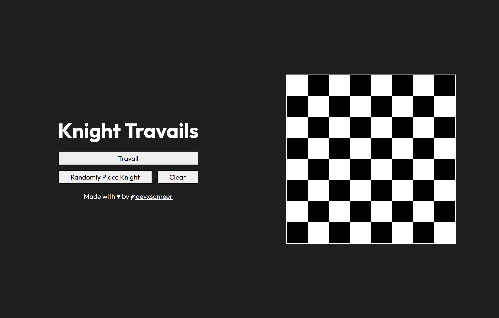

# ♞ Knight Travails

Implementation of the **Knight Travails Project** from [The Odin Project](https://www.theodinproject.com/).  
This project demonstrates how to calculate the shortest path a knight can take on a standard chessboard using **Breadth-First Search (BFS)**.

It also includes a simple **UI demo** to visualize knight movements on an interactive chessboard.

---

## 📚 Overview

- Place a knight on an 8x8 chessboard.
- Select a **starting** and **target** square.
- The program computes the **shortest sequence of knight moves**.
- Algorithm uses **graph traversal (BFS)**.

---

## 🛠️ Features

- ⚡ **Breadth-First Search** ensures shortest path.
- 🎨 Interactive chessboard UI.
- 🎲 Random knight placement.
- 🧹 Clear/reset board functionality.

---

## 🚀 Usage

1. Open `index.html` in your browser.
2. Click a square to set the knight’s **start position**.
3. Click another square to set the **target position**.
4. Hit **Travail** to animate the shortest path.
5. Use **Randomly Place Knight** or **Clear** as needed.

---

## 🌐 Live Demo

👉 [Knight Travails on GitHub Pages](https://devxsameer.github.io/knight-travails/)

---

## 🖼️ Demo Preview



---

## 🧩 Example

Shortest path from **[0,0]** to **[3,3]**:

```
[0,0] → [1,2] → [3,3]
```

## 📖 Learning Goals

- Apply **graph traversal algorithms** to solve real problems.
- Understand **Breadth-First Search (BFS)**.
- Bridge algorithm logic with **UI visualization**.

---

This project is part of [The Odin Project Curriculum](https://www.theodinproject.com/).

Built with ❤️ by `Sameer Ali`.
